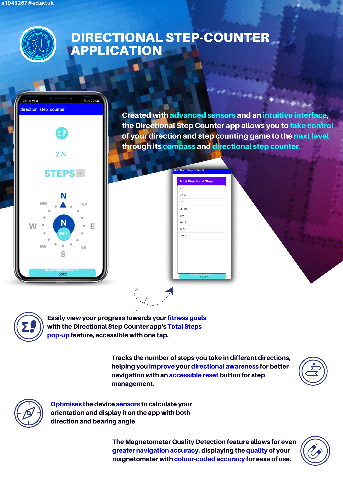

> A more detailed user guide and programmer's guide can be found inside the [docs](/docs) folder.
---

# Programmer’s Guide to Directional Step Counter

## Application Interface and functionality
A project that is done under Embedded Systems 5 (EWireless5) in the University of Edinburgh which will go through most of the frameworks, methods, and implementations of Android Operating Systems. The Android Studio software and Java programming language is mostly used in this project. The softare testing from the different classes, methods, listeners, and sensors will be done using the Object Oriented Programming (OOP) style in API 28 environment on a Google Pixel 2 emulator. The hardware testings are done in my own android phones, Samsung Galaxy A7 2018 and Samsung S20+, and the provided university phone, Google Pixel 2. 
The [directional step counter (DSC)](android_projects/direction_step_counter) application is built in Android Studio using Java to integrate various application interfaces (API) for the Android OS. It aims to create a compass, a directional step counter, and a magnetometer quality detector using the following APIs:

- Android Sensors API 
- Android Permissions API 
- Android Animations API 
- Android User-Interface (UI) API 
- Android Context API

According to the [Android documentation](https://developer.android.com/reference/android/hardware/Sensor), the Android Sensors API incorporates:

- `TYPE_ACCELEROMETER`
- `TYPE_GYROSCOPE`
- `TYPE_MAGNETIC_FIELD`
- `TYPE_STEP_COUNTER`
- `TYPE_STEP_DETECTOR`

Permissions to access sensors and high sampling rates are requested using the Android Permissions API. User-friendly UIs are constructed using both Java classes and XML layout files, integrating rotating animations, various views, and layouts.

## Classes, Methods, Sensors, and Listeners

- **MainActivity class**: The hub of the application.
    - Manages sensors and performs calculations to output UI data.
    - Implements `SensorEventListeners` to access device's sensors.
    - Uses `Sensor` class objects to interface with sensors and `SensorManager` class (referred to as `sm`).
    - `onCreate()`: Sets up the layout and starts the app's lifecycle.
    - Permissions and sensors initialization occurs in the `stepSensorChecks()` and `initialization()` functions respectively.
    - UI components are identified using the `findViewById()` method.
    - As sensor values change, the `onSensorChange()` function is invoked which includes:
        1. A switch-case statement for sensors.
        2. `directionalSteps()` function.
        3. `magnetometerQuality()` function.
        4. `calculateOrientation()` function.

    - Other key methods include: `onAccuracyChanged()`, `onResume()`, `onPause()`, and `onDestroy()`.

## Data processing

- **calculateOrientation()**: Uses accelerometer and magnetometer data for compass orientation. Employs the `getRotationMatrix()` and `getOrientation()` methods with values filtered using a low-pass filter.
- **directionalSteps()**: Tracks step count and compass direction. Utilizes the step counter sensor.
- **magnetometerQuality()**: Evaluates the quality of the magnetometer by comparing bearings computed from the magnetometer and gyroscope.

Data is displayed in the `activity_main.xml` file. The rotating compass animation is handled with the `RotateAnimation` class.

## Extra features

- **Reset Button**: Resets the directional step count.
- **Total Step Button**: Displays the total steps in a pop-up window.

## References

1. [Sensor: Android Developers](https://developer.android.com/reference/android/hardware/Sensor)
2. [Motion sensors: Android Developers](https://developer.android.com/guide/topics/sensors/sensors_motion)

# License

This project is licensed under the [MIT License](https://opensource.org/licenses/MIT) and is open for any contributions.

